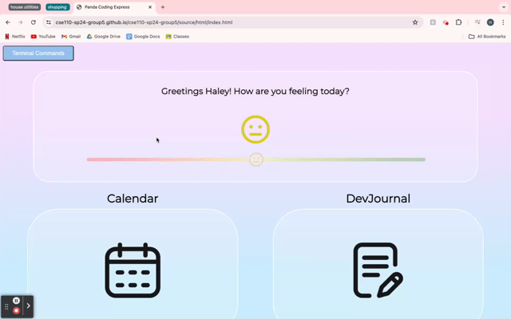
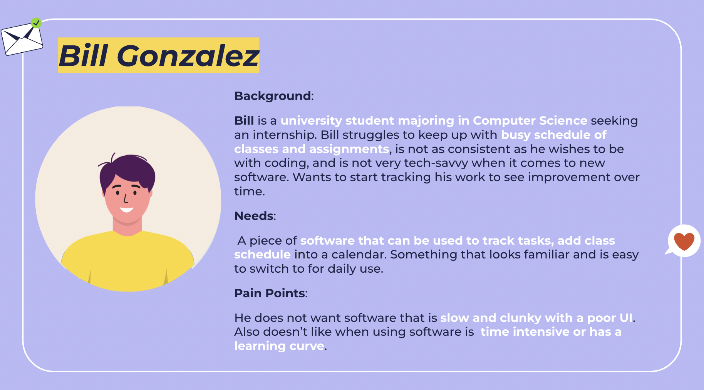
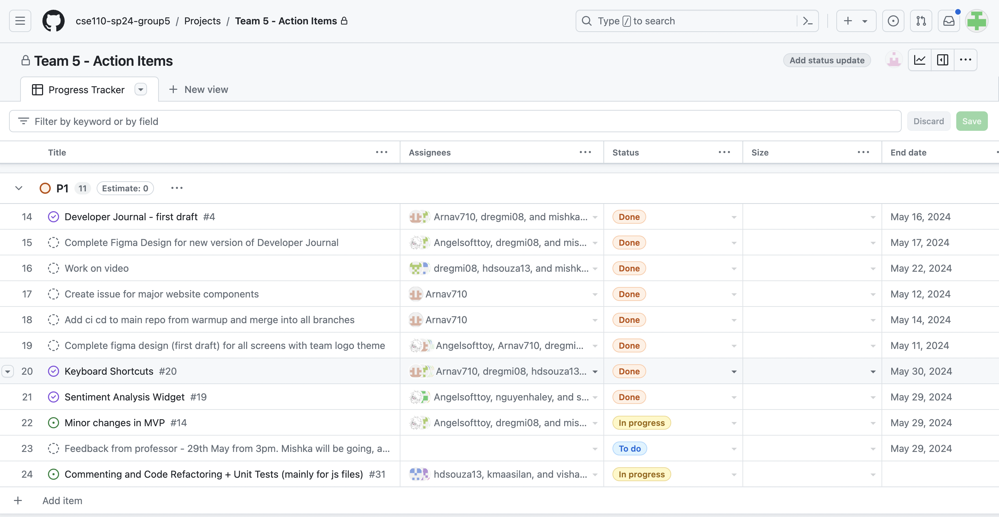

# CSE110 SP24 Group 5

### Click on our logo to see our WebApp!

Welcome to the repository for CSE110 SP24 Group 5's project! This document will guide you through the various features of our application, provide links to essential resources, and outline our project’s current status.  

## Team Members

- Drishti Regmi
- Haley Nguyen
- Vishaal Gaddipati
- Nicholas Cheah
- Angel Ren
- Hugo D Souza
- Stephen Tong
- Maasilan Kumaraguru
- Xavier Navarro
- Arnav Modi (Team Lead)
- Mishka Jethwani (Team Lead)
  
Visit the [team page](https://cse110-sp24-group5.github.io/cse110-sp24-group5/admin/team) to learn more about our team members.

## Table of Contents
- [Introduction](#introduction)
- [Installation and Setup](#installation-and-setup)
    - [Using it locally](#1-using-it-locally)
    - [Using the WebApp](#2-using-the-webapp)
    - [Using the Progressive Web App (PWA)](#3-using-the-progressive-web-app)
- [Features](#features)
    - [Dashboard](#1-dashboard)
    - [Calendar](#2-calendar)
    - [Dev Journal](#3-dev-journal)
    - [Keyboard Shortcuts](#4-keyboard-shortcuts)
- [CI/CD Pipeline](#cicd-pipeline)
- [Linting](#linting)
- [JSDoc](#jsdoc)
- [Testing](#testing)
    - [Codacy Tests](#codacy-tests)
    - [Unit Tests](#unit-tests)
    - [E2E Tests](#E2E-tests)
- [Agile Concepts](#agile-concepts)
- [Application of the -ilities](#application-of-the-ilities)
- [Resources](#resources)

## Introduction
In the fast-paced world of software development, productivity and mental well-being are crucial for success. Developers often find themselves juggling multiple tasks, deadlines, and responsibilities, which can lead to burnout and decreased efficiency. Our project aims to provide a comprehensive solution to address these challenges by offering a journal that not only boosts productivity throughout the development process but also helps developers keep track of their mental health.

The journal serves as a centralized hub where developers can effectively manage their tasks, document their progress, and reflect on their daily experiences. By combining powerful features such as a calendar, task management, and a markdown-enabled development journal, our application streamlines the workflow and encourages mindful practices. With the calendar feature, developers can easily navigate through different months, view task lists, and manage their tasks seamlessly. The development journal component allows developers to document their activities, thoughts, and learnings using a user-friendly markdown editor, while also selecting the roles they fulfilled on a given day. By integrating mental health considerations, our journal encourages developers to prioritize their well-being through regular reflection and journaling.

## Installation and Setup
### 1. Using it locally

To install and run the project locally, follow these steps:

1. Clone the repository to your local machine using the following command:
   
        git clone https://github.com/cse110-sp24-group5/cse110-sp24-group5.git

2. Navigate to the project directory:

        cd cse110-sp24-group5

3. Install the required dependencies by running:
   
        npm install
   
5. Once the installation is complete, you can start the development server with:

        npm start

### 2. Using the WebApp

To use our WebApp you can use the following link: https://cse110-sp24-group5.github.io/cse110-sp24-group5/source/html/index.html oe click on our logo

### 3. Using the Progressive Web App

Our developer journal isn't just a web app; it's also a Progressive Web App (PWA), offering a native-like experience with offline access, fast loading times, and home screen integration. This means you can access your tasks, calendar, and journal entries anytime, anywhere, even without an internet connection.
To use our PWA, simply visit our WebApp and click the "Install" or "Add to Home Screen" icon in your browser. Once installed, our app's icon will appear on your device's home screen, providing instant access to your productivity tools wherever your development work takes you.

## Features

### 1. Dashboard

- **Navigation**: Users can seamlessly move through different months using intuitive buttons for the calendar and Dev Journal, ensuring easy access to past and future dates.

- **Sentiment Analysis**: For a quick way to keep track of the moods of our users and help them in their self-care journey as software engineers. We have a mood tracker where you can rate your mode based on a slider which is then converted into a corresponding emoji stored in the calendar for that day!

- **Terminal Commands**: In the top left corner, once clicked, a shortcut of all possible terminal commands are given so that users can easily navigate within features.

### 2. Calendar

The calendar feature provides a comprehensive view of tasks and events, allowing developers to efficiently manage their schedules and stay organized.

- **Task Viewing**: By clicking on a specific day, users can view the task list associated with that date. The number of tasks for a given date is visually displayed on the calendar page, providing an at-a-glance overview of workload distribution. Tasks are retrieved from localStorage, ensuring data persistence across sessions.

- **Task Management**: Users can add, edit, and remove tasks for any given day directly from the calendar interface. This streamlined workflow promotes efficient task organization and management.

- **Saving Tasks**: To ensure data integrity, users can click the save button to store their tasks in localStorage, enabling seamless access to their task lists across multiple sessions or devices.

### 3. Dev Journal

The Dev Journal feature provides a dedicated space for developers to document their daily activities, thoughts, and learnings, fostering personal growth and reflection.

- **Default View**: Upon opening the Dev Journal, users are presented with the current date by default, ensuring a smooth and intuitive start to their journaling experience.

- **Date Picker**: A user-friendly date picker allows users to easily switch between dates, enabling them to access and update journal entries for any specific day.

- **Markdown Editor**: Leveraging the power of Markdown, the Dev Journal offers a rich and versatile editing experience. Users can write and preview their journal entries using a fully-featured markdown editor, supporting formatting, code snippets, and other advanced features.

- **Scrolling**: If the content exceeds the viewable area, users can seamlessly scroll within both the preview and the editor panes, ensuring a comfortable and uninterrupted writing experience.
  
- **Toggle View**: With the click of a button, users can toggle between the editor and the preview views, allowing for efficient switching between writing and reviewing modes.

- **Role Selection**: To provide context and clarity, users can select the roles they fulfilled on a given day, such as working on code, documentation, debugging and communication.  This feature enhances the journaling experience by
  encompassing the different roles a software engineer fulfils.

- **Bug Tracker**: To help Software Engineers keep track of unique Bugs they encounter and their solutions, we have a space to track bugs. This can also be a metaphor to bugs or problems they encounter in their lives as a Software Engineer and not just Bugs related to Code.

- **Learnings**: To help our user keep track of thier daily learning we have dedicated a space to this.
  
- **Saving Data**: All input data, including journal entries and selected roles, is automatically saved to localStorage upon clicking the save button, ensuring data persistence and enabling users to pick up where they left off seamlessly.

### 4. Keyboard Shortcuts

To help developers quickly navigate through our features, we included keyboard shortcuts (all of which are case insensitive) that can used in the terminal for efficient usage of our application. 

- **Opening Terminal**: `ctrl` + `\`

- **Homepage Shortcuts**:
    * Go to developer journal: `cd dev-journal`
    * Go to calendar: `cd calendar`

- **Developer Journal Shortcuts**:
    * Go to dashboard: `cd..`
    * Preview markdown document: `md p`
    * Edit markdown document: `md e`
    * Write learnings: `l`
    * Write bugs: `b`
    * Choosing roles:
        * debugging: `bug`
        * documentation: `doc`
        * coding: `code`
        * communication: `com`

- **Calendar Shortcuts**:
    * Choosing a date: `DD`
    * Choosing a month and year: `MM/YYYY`
    * Deleting a task: `taskname d`
    * Editing a task: `taskname e`

## CI/CD Pipeline
Our Continuous Integration/Continuous Deployment (CI/CD) pipeline is the backbone of our development process, ensuring that every code change maintains our project's quality and reliability. This automated workflow catches issues early, facilitates rapid iterations, and allows our team to focus on innovation rather than manual checks. It consists of the following.

1. **Linters:** Linters automatically scan every line of code for style inconsistencies, potential bugs, and bad practices. We use ESLint for JavaScript to catch syntax errors and enforce best practices, StyleLint for CSS to maintain consistent styles and flag inefficiencies, and HTMLHint for HTML to ensure proper structure and accessibility. Running on every commit and pull request, these tools not only catch issues early but also foster a consistent, readable codebase that eases collaboration and reduces bugs.

2. **JSDoc:** JSDoc transforms our inline documentation into a comprehensive, navigable manual. It parses our JavaScript files, extracting function signatures, class hierarchies, and module relationships to generate structured HTML docs. With features like type annotations, example usage, and architectural tags, JSDoc turns our codebase into a self-teaching tool. Running after linting in our CI/CD pipeline, it ensures our documentation always reflects our latest, standards-compliant code.

3. **Codacy Analysis:** While linters focus on syntax, Codacy dives deep into our code's health. This tool provides a holistic analysis across all our languages—JavaScript, CSS, and HTML—assigning an overall quality score. It identifies complex methods needing refactoring, flags security vulnerabilities like unsafe function usage, and suggests performance improvements. By tracking these metrics over time and setting quality gates in our CI/CD, Codacy doesn't just maintain our code; it drives a culture of continuous improvement.

4. **Unit Tests:**  Using Jest, we rigorously test everything from core utilities like our Markdown parser to individual class methods. Running after static analysis in our CI/CD, a failing unit test halts deployment, pinpointing exact issues.

5. **End-to-End (E2E) Tests**: Our final and most comprehensive checks, E2E tests simulate real developer journeys through our application. Using Puppeteer to control a real Chrome browser, each test mirrors typical workflows. Beyond just UI interactions, we verify data integrity in storage and even run accessibility and performance checks. As the last gate in our CI/CD pipeline, these tests ensure that all our components work together.

Each stage of our CI/CD pipeline serves a distinct purpose, from enforcing code style to simulating user experiences. Together, they form a robust system that not only catches issues early but continually guides our project toward higher quality, clearer architecture, and a superior user experience.

## Linting
Linting is a crucial practice that helps ensure code quality, consistency, and maintainability across the entire codebase. In this project, linting has been set up for HTML, CSS, and JavaScript to adhere to industry-standard best practices and coding conventions. HTML linting checks for proper markup structure, CSS linting maintains consistent stylesheet styles, and JavaScript linting catches syntax errors, potential bugs, and performance issues in the application's logic and functionality.

We have implemented automated linting checks performed on every push or pull request to make sure potential issues are caught early in the development process, and make sure that our coding standard is met. When you push changes, on GitHub you will be able to see a tick or cross next to it based on whether it passes that check. You can click on the same to view details. Along with this you can also run the linter locally.
 
1. **ESLint**: Helps detect syntax errors and code style issues in our JavaScript
    * `npx eslint "**/*.js"` to run on all JS files
      
2. **StyleLint**: Helps detect style issues in CSS
    * `npx stylelint "**/*.css"` to run on all CSS files in the directory
      
3. **HTML Linting**: Helps detect issues in our HTML
    * `npx htmhint "**/*.html"` to run on all HTML files in the directory
      
4. **Fixing local linter issues**: Run all commands with `--fix` tag in order to fix the linter issues.

## JSDoc

Automated and up-to-date documentation: By integrating JSDoc into our CI/CD pipeline, the documentation is automatically generated and updated whenever changes are pushed, ensuring that the documentation always reflects the latest codebase.

Consistent formatting and structure: JSDoc provides a consistent and standardized format for documenting functions, classes, and other code elements, making it easier for developers to navigate and understand the codebase.

Integration with development tools: Many IDEs and code editors have built-in support for JSDoc, allowing developers to easily view and access documentation while writing code.

## Testing

1. **Unit Tests**: 
    * Run all unit tests in the directory using:
        * `npm run unitTests`
          
    * Run a specific unit test file in the directory using:
        * `npm run unitTests -- <path to file>`
   
2. **E2E Tests**: We created a variety of comprehensive E2E tests to ensure that there are no issues or bugs in our application following any possible action a user could take.
    * List of our testing suites:
        * `home-page.e2e.js` which tests our homepage 
        * `dev-journal.e2e.js` which tests our developer journal feature
        * `taskListTestSuite.e2e.js` which tests our calendar and task-list feature
          
    * Run all E2E tests in the directory using: 
        * `npm run e2eTests`
          
    * Run a specific E2E test file in the directory using:
        * `npm run e2eTests -- <path to file>`

## Agile Concepts

1. **User Stories**

   
3. **Sprint**: 

   
4. **Sprint Review**: A meeting done at the end of each sprint, held to discuss what was accomplished in our sprint and our individual contributions.
    * [Sprint Review #1](admin/meetings/042724.sprint-1-review.md)
    * [Sprint Review #2](admin/meetings/052324-2nd-Sprint-Meeting.md)
   
5. **Retrospective**: A meeting held after the sprint review used to reflect our previous sprint and discuss the high level issues of what went right and wrong. 
    * [Retrospective meeting #1](admin/meetings/042724-retrospective.md)
    * [Retrospective meeting #2](admin/meetings/052324-2nd-Retrospective.md)

6. **Burn Down Chart**: In order to keep track of our progress throughout our development process, how much we have accomplished, and how much more we need to accomplish, we utilized GitHub Projects' project tracker.

## Application of the -ilities

1. **Functional Suitability**: 
- Testing : We designed comprehensive unit and end-to-end tests utilizing Jest to ensure that all bugs and issues in our application have been addressed. We discuss our testing methods more in depth [here](#testing).

2. **Usability:**

- Intuitive User Interface: Our application prioritizes an intuitive and user-friendly interface to enhance the overall usability for developers. The clean and minimalistic design, coupled with clear labeling and visual cues, ensures a smooth learning curve and seamless navigation.
  
- Responsive Design: To cater to a diverse range of devices and screen sizes, our application employs responsive design principles. This ensures that the layout and content adapt seamlessly, providing an optimal viewing and interaction experience across desktops, tablets, and mobile devices.

3. **Maintainability:**

- Modular Architecture: Our codebase follows a modular design approach, where functionality is divided into separate, self-contained components. This modularity promotes code reusability, simplifies debugging, and facilitates future enhancements or modifications without impacting the entire system.
  
- Adherence to Coding Standards: We strictly adhere to industry-standard coding practices and conventions, ensuring consistent formatting, naming conventions, and coding styles throughout the project. This commitment to coding standards enhances code readability and maintainability, making it easier for developers to understand and modify the codebase as needed.

4. **Scalability:**

- Efficient Data Storage: By leveraging efficient data storage mechanisms like localStorage, our application can handle growing amounts of user data without compromising performance. This approach ensures that the application scales gracefully as the user base and data requirements increase over time.
  
- Modular Design: The modular architecture of our application facilitates scalability by allowing individual components to be scaled independently based on resource demands. This flexibility enables the application to adapt to changing workloads and accommodate future growth without significant architectural changes.

5. **Accessibility:**

- Keyboard Navigation: To cater to users with disabilities or those who prefer keyboard-based interactions, our application supports extensive keyboard navigation capabilities. Users can seamlessly navigate through the application's features and functionalities using intuitive keyboard shortcuts, ensuring an inclusive and accessible experience.
  
- Markdown Editor Accessibility: The integration of a markdown editor in our Developer Journal feature enhances accessibility for users with diverse needs. Markdown's simplicity and plain-text nature make it easier to navigate and comprehend content using assistive technologies, such as screen readers or text-to-speech software.

By addressing these '-ilities', we strive to deliver a high-quality software solution that meets the needs of developers while ensuring a seamless, reliable, and accessible user experience. Our commitment to usability, maintainability, scalability, reliability, and accessibility is reflected throughout the application's design and implementation.
## Resources

1. Video links:
    * [**Team Video**](https://www.youtube.com/watch?v=mqnLJw1I7lg).
    * [**MVP/EC Video**](https://youtu.be/2HepYe5-YLw).
    * [**Status Video 2**](https://www.youtube.com/watch?v=myacnpHmjUQ).

2. Design resources:
    * [**Miro Board**](https://miro.com/app/board/uXjVKMiOIZM=/).
    * [**Figma Mockup**](https://www.figma.com/design/V6eBR6UbPtpxFRhxyXcO3T/team-5-figma-board?node-id=0%3A1&t=WDiy1Dt2cr4rP5Ny-1).

