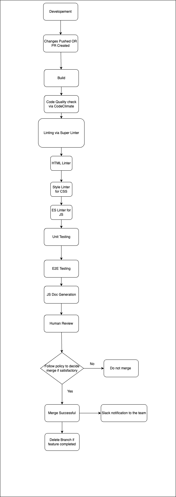
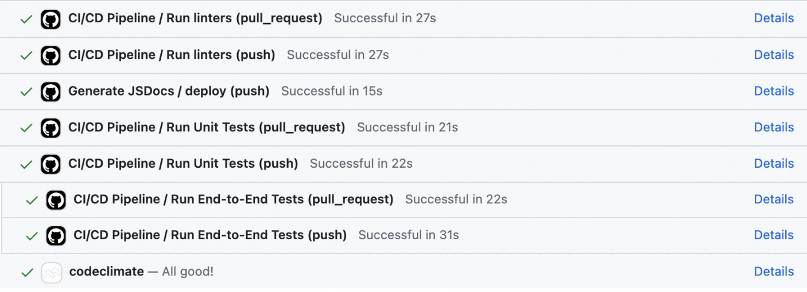

# CI/CD Pipeline

## Table of Contents

- [Submitting a PR](#submitting-a-pr)
- [Linting and Code Style Enforcement](#linting-and-code-style-enforcement)
- [Code Quality via Tool](#code-quality-via-tool)
- [Unit tests via Automation](#unit-tests-via-automation)
- [E2E Testing](#e2e-testing)
- [Documentation Generation via Automation](#documentation-generation-via-automation)
- [Code Quality Human Review](#code-quality-human-review)
- [Branch Management](#branch-management)
- [Demo](#demo)

## Submitting a PR

Strict Policy on PRs:

This template is a standard format for creating a pull request (PR) description on a software development project. It aims to provide a structured way of communicating the changes made in the PR, along with testing instructions, screenshots (if applicable), and a checklist for ensuring code quality and adherence to project standards. The template helps maintain consistency and clarity in PR descriptions, facilitating code reviews and collaboration among team members.

The following template should be used when submitting a PR
``` Template:

*Description*

[Describe the changes made by this PR and the problem it solves]

*Changes Made*

- [List the specific changes made in bullet points]

*Testing*

[Provide step-by-step instructions for testing the changes introduced by this PR]

*Screenshots* (if applicable)

```

## Linting and Code Style Enforcement 

Implemented via Super Linter
We are using 3 linters:
- HTML Linter
- Style Linter for CSS
- ES Linter for JS

Linting helps enforce code conventions and prevents bugs and code errors. Linting maintains the readability and consistency of our codebase.

As of now, whenever a pull request or push is made, the code in the branch that's being pulled from is run through each of these automatically and flagged as either successful or failing. Team members can then address the issues flagged by the linter before changes are merged into the main branch.

## Code Quality via Tool

Implemented via Code Climate

Code quality tools flag low-quality code through static code analysis and prevent low-quality code from reaching the main branch. Additionally, code quality tools prevent security vulnerabilities in our codebase.

As of now, whenever a pull request is made or commit is pushed, the code in the branch that's being pulled from is run through Code Climate automatically and flagged as either successful or failing. Team members can then rectify any code quality issues before changes are pushed to main.

It would be helpful to have more information about the specific code quality checks or rules that Code Climate is configured to run, as well as any thresholds or criteria for determining whether the code quality check passes or fails.

## Unit tests via Automation
We decided to go with ***Jest*** as our project is built using HTML, CSS, and JavaScript, and Jest is well-suited for testing JavaScript codebases. Its comprehensive testing capabilities, including unit testing, integration testing, and snapshot testing, ensure that we can thoroughly test our JavaScript code and catch any potential issues or regressions.

Secondly, we have implemented linting and code quality checks using CodeClimate, and Jest seamlessly integrates with such tools. This integration allows us to enforce code quality standards and catch potential issues or violations during the testing process, ensuring that our codebase adheres to best practices and maintains a high level of quality.

Another factor that influenced my decision was Jest's zero-configuration setup. Getting started with testing can be a daunting task, but Jest's zero-configuration approach made it easy for us to start writing tests right away without spending time on complex configurations. This was particularly beneficial for our team, as we had a tight timeline and limited experience with testing frameworks.


As of now, whenever a pull request is made or commit is pushed, the code in the branch that's being pulled from is run through all unit tests automatically and flagged as either successful or failing. Team members can then fix any issues found in their code.

It would be helpful to have more information about the specific unit test cases or test coverage targets that the team has set for the project, as well as any guidelines or best practices for writing and maintaining unit tests.

## E2E Testing
Implemented via Puppeteer and Jest

E2E testing helps check whether all of our code works together in facilitating our application's features.The plan is for the E2E tests to run automatically upon the submission of a pull request or when code is pushed.
We have implemented E2E testing using PuppeteerWe chose Puppeteer for the following reasons:

- Compatibility with Jest: Puppeteer integrates seamlessly with Jest, our chosen unit testing framework, allowing us to leverage the same testing structure and tooling for both unit and E2E tests.
- Ability to automate browser interactions: Puppeteer allows us to simulate real user interactions within a browser, enabling us to test our application's UI and functionality in a realistic environment.
- Performance and scalability: Puppeteer is designed to be efficient and scalable, making it suitable for running E2E tests in our continuous integration (CI) environment.

## Documentation Generation via Automation

Implemented via JSDoc.

Whenever a commit is pushed or a PR is created, changes are automatically made to a branch called `gh-pages`, and when we open that on the browser, it displays a well-formatted documentation for all the functions and their descriptions.

You can access the documentation for our warm-up project, which was a calendar, [here](https://cse110-sp24-group5.github.io/calendar/global.html#addEventListenerToDay).

JSDoc is a popular tool for generating documentation from JavaScript source code comments. By following a specific commenting syntax, developers can document their code, and JSDoc will generate an HTML-based documentation website from those comments.

Using JSDoc for documentation generation offers several advantages:

- **Automated and up-to-date documentation**: By integrating JSDoc into our CI/CD pipeline, the documentation is automatically generated and updated whenever changes are pushed, ensuring that the documentation always reflects the latest codebase.

- **Consistent formatting and structure**: JSDoc provides a consistent and standardized format for documenting functions, classes, and other code elements, making it easier for developers to navigate and understand the codebase.

- **Integration with development tools**: Many IDEs and code editors have built-in support for JSDoc, allowing developers to easily view and access documentation while writing code.

By implementing documentation generation via JSDoc and integrating it with our CI/CD pipeline, we aim to streamline the documentation process, ensure consistency, and provide up-to-date and comprehensive documentation for our codebase.

## Code Quality Human Review

Make sure the following are met when deciding upon merging the PR.

- [ ] All automated tests pass locally.
- [ ] Manual testing has been performed according to the provided instructions.
- [ ] Code follows the project's coding conventions and standards.
- [ ] Documentation has been updated to reflect any relevant changes.
- [ ] This PR has been reviewed by at least 2 of the team members.
- [ ] It passes all the appropriate Linters
- [ ] Make sure it passes CodeClimate quality checks

#### Additional Notes (if any)

Reviewing Guidelines
Atleast 2 team members should review the PR before it can be merged.
All automated tests should pass locally.
The code should follow the project's coding conventions and standards.
It should pass all appropriate linters and CodeClimate quality checks.
Reviewers should focus on the following aspects:
- Code Quality: Ensure that the code follows the project's coding conventions and standards, and adheres to best practices for maintainability, readability, and performance.
- Functionality: Verify that the changes introduced by the PR work as intended and do not break existing functionality.
- Testing: Review the provided testing instructions and ensure that they cover all the relevant scenarios and edge cases.
- Documentation: Check if the documentation has been updated to reflect the changes made in the PR.
- Security: If applicable, assess the changes for potential security vulnerabilities or areas of concern.

## Branch Management 

- Make sure each branch is given an appropriate/descriptive name e.g. (team/feature-name or bug-name)
- Enforce branch protection to ensure that direct pushes to main are not made, review all PRs manually and carefully

Pruning Old Feature Branches:
- Cleanup repo branches from time to time, delete branches that have already been merged, abandoned, or have been inactive
- Enforce occasional team reviews of branches so team members can discuss which branches to remove or merge
- Ensure communication between team members when editing the repo's branches, one person's decision to remove branches should not be a surprise to anyone


## Demo

Here is the diagram of our workflow currently:


Here is an example of what can be seen when a PR is created or a commit is pushed



