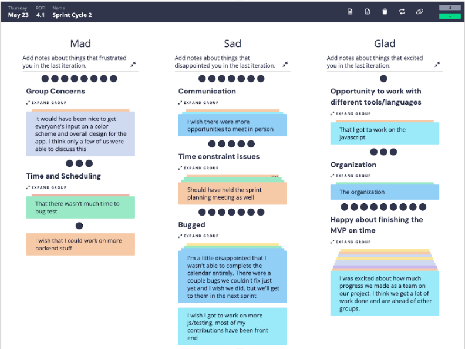
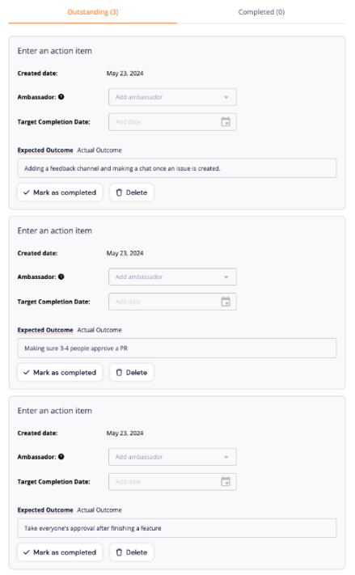
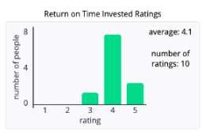

# Meeting Information
**Team Number and Name**: 5 Panda Coding Express

**Type of Meeting**: 2nd Retrospective Meeting

 **Meeting Date and Location**: 05/23/2024 In-person (Catalyst)

**Meeting Purpose**: Debrief the 2nd sprint/Plan for the next one

## Attendees
+ Mishka Jethwani
+ Arnav Modi
+ Drishti Regmi
+ Maasilan Kumaraguru
+ Nicholas Cheah
+ Hugo D Souza
+ Vishaal Gaddipati
+ Haley Nguyen
+ Xavier Navarro
+ Angel Ren
+ Stephen Tong

## Agenda Items
#### Unresolved from previous meeting
N/A

#### Things to be discussed
+ Gather eveyones thoughts on how the project went (positives/negatives).
+ What could have been done better?
+ How can we learn from this sprint to function better as a team for the next one?
+ What are some actions that can be taken to reach our goals?

#### Unresolved from this meeting
N/A

## Retrium

### Mad, Sad, Glad

#### **Most Voted Three Suggestions**
+ More meetings between each language development's group,increase collaborations through more weekly meetings.
+ Implement more features for the project product than the warm-up. 
+ Previewing future labs early to provide better assistance in future projects.

### Outstanding Action Items

### Return on Time Invested Ratings

### Action Items

| Done? | Task                                    | People                                  | Due Date         |
|-------|-----------------------------------------|-----------------------------------------|------------------|
| Yes   | Retrospective Meeting 2      | Mishka, Vishaal, Drishti, Arnav, Nicholas, Haley, Angel, Xavier, Maasilan, Hugo, Stephen| TBD |

## Other Notes & Information
N/A
