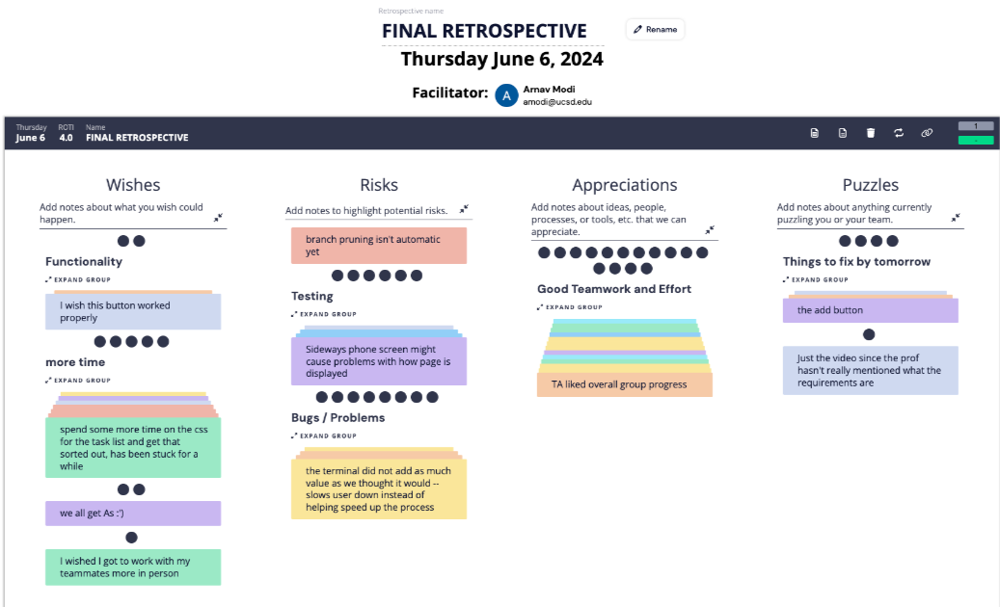
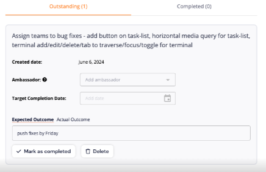
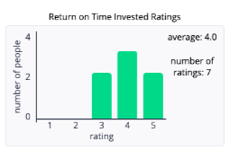

# Meeting Information
**Team Number and Name**: 5 Panda Coding Express

**Type of Meeting**: 3rd and Final Retrospective Meeting

 **Meeting Date and Location**: 06/06/2024 In-person (Catalyst)

**Meeting Purpose**: Debrief the final sprint

## Attendees
+ Mishka Jethwani
+ Arnav Modi
+ Drishti Regmi
+ Maasilan Kumaraguru
+ Nicholas Cheah
+ Hugo D Souza
+ Vishaal Gaddipati
+ Haley Nguyen
+ Xavier Navarro
+ Angel Ren
+ Stephen Tong

## Agenda Items
#### Unresolved from previous meeting
N/A

#### Things to be discussed
+ Gather eveyones thoughts on how the project went (positives/negatives).
+ What could have been done better?
+ How can we learn from this sprint to function better in future endevors.
+ What are some actions that can be taken to reach our goals?

#### Unresolved from this meeting
N/A

## Retrium

### Wishes, Risks, Appreciations, and Puzzles

#### **Most Voted**
+ Great teamwork and effort demonstrated throughout the sprint.
+ There is still some improvements that can be made to the functionality which can add signficant value.
+ More time could spent on testing for edge cases and different sized screens.
+ Time in general could mend a lot of these issues.

### Outstanding Action Items

### Return on Time Invested Ratings

### Action Items

| Done? | Task                                    | People                                  | Due Date         |
|-------|-----------------------------------------|-----------------------------------------|------------------|
| Yes   | Retrospective Meeting 3      | Mishka, Vishaal, Drishti, Arnav, Nicholas, Haley, Angel, Xavier, Maasilan, Hugo, Stephen| TBD |

## Other Notes & Information
N/A
