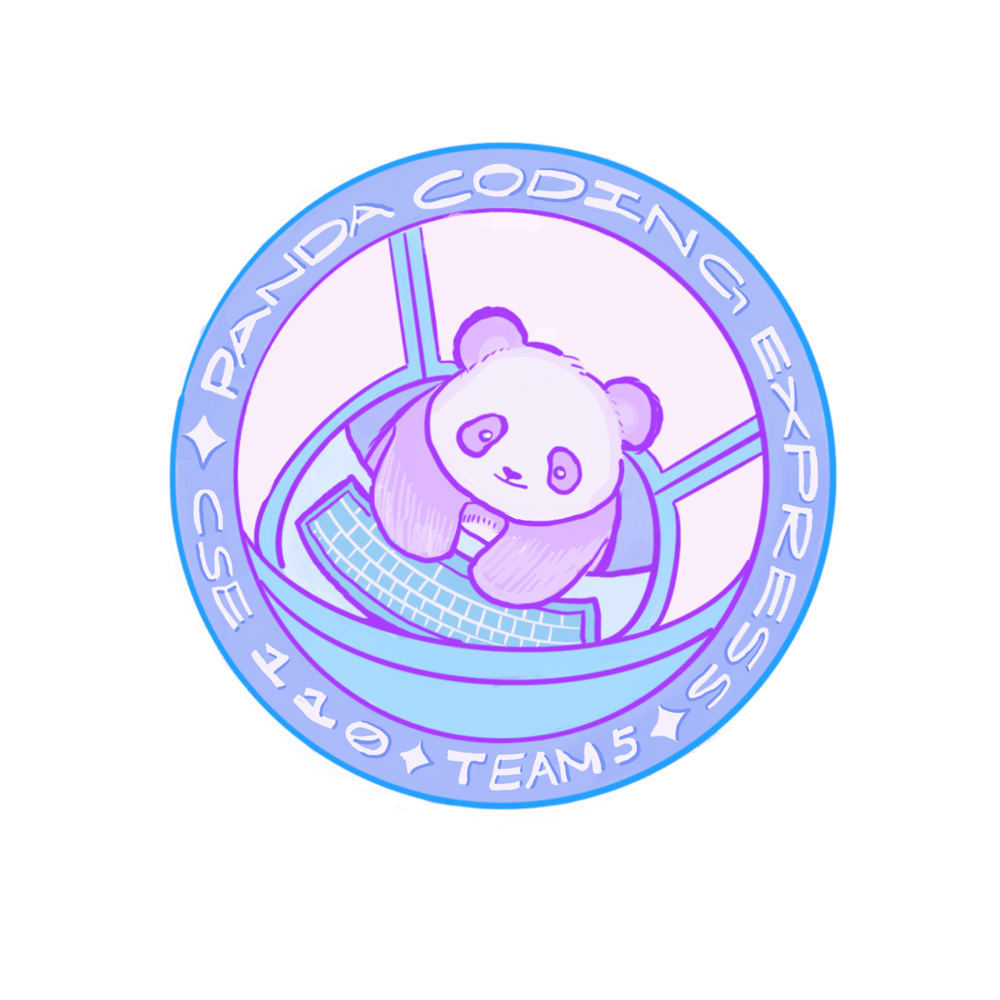
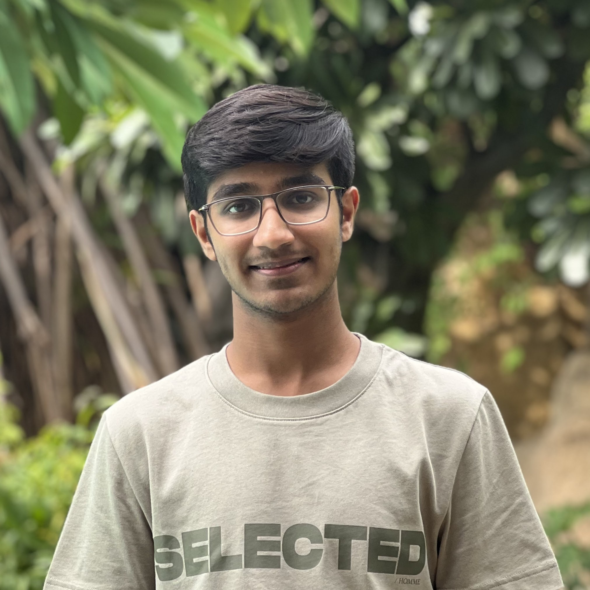
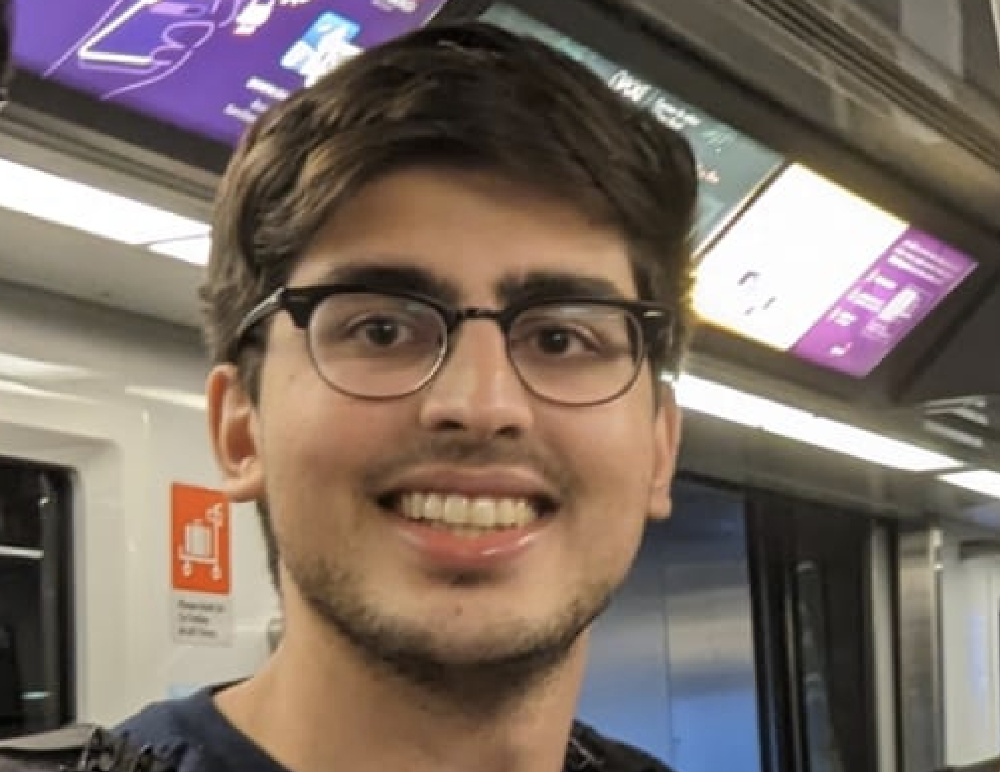

# Panda Coding Express
Welcome to the Panda Coding Express page, where your code is delivered quick and efficiently!

 

comment- put team in alphabetical order other than team leads in the front, don't know if you want to do something special with them  
comment- also don't know if we need more than a sentence for our "brief introduction"  
## Meet Our Team
Feel free to visit our team's individual pages to learn more about us!  
 

**Arnav** (team lead):   Arnav is a 2-nd year CS major at Revelle! He likes working out and playing soccer.

[Arnav's Page](https://arnav710.github.io/user_page/) 

**Mishka** (team lead):  

[Mishka's Page](https://github.com/mishkajethwani/CSE-110-git-pages)  

**Angel**:  

[Angel's Page](https://angelsofttoy.github.io/cse110_angel/)  

**Drishti**:  

[Drishti's Page](https://dregmi08.github.io/cse110_lab1/)  

**Haley**:  

[Haley's Page](https://github.com/nguyenhaley/GitHubPagesProject)

**Hugo**:  

[Hugo's Page](https://hdsouza13.github.io/lab1-cse110/)

**Maasilan**:  

**Nicholas**:  

[Nicholas' Page](https://cheahfulnic.github.io/Lab-Week-1---VSCode-Markdown-and-Git-Part-1/)  

**Stephen**: Stephen is from San Clemente and loves going to the gym and hanging out with his friends!  

[Stephen's Page](https://stephentong5.github.io/GithubPagesProject/)  

**Vishaal**: Vishaal is from Santa Clarita and enjoys playing tennis and watching movies!  

[Vishaal's Page](https://vishaal-gaddipati.github.io/CSE110Lab1/)  

**Xavier**:  

## Values We Hold Dear
In everything we make, we strive for the best experience for the user.
