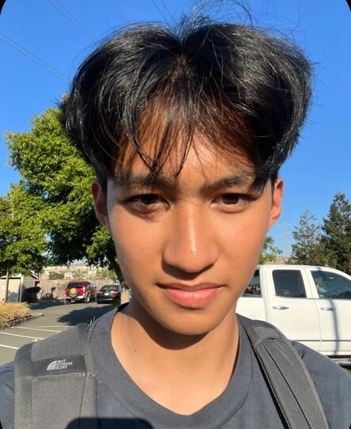

# Panda Coding Express
Welcome to the Panda Coding Express page, where your code is delivered quick and efficiently! We are a group of undergrads enrolled in CSE 110 at UCSD and this is our team page.

## Meet Our Team
Feel free to visit our team's individual pages to learn more about us!  
 

**Arnav** (team lead):   Arnav is a 2nd year CS major at Revelle! He likes working out and playing soccer!

[Arnav's Page](https://arnav710.github.io/user_page/) 

**Mishka** (team lead):   Mishka is second-year CS major from India who loves to dance and explore resturants and cafes in her free time!

[Mishka's Page](https://github.com/mishkajethwani/CSE-110-git-pages)  

**Angel**:   Angel is a fourth year CSE minor at Sixth who likes to listen to music, play games, and draw!

[Angel's Page](https://angelsofttoy.github.io/cse110_angel/)  

**Drishti**:   Drishti is a second-year CS major at Marshall who likes to journal and go to art museums in her free time!

[Drishti's Page](https://dregmi08.github.io/cse110_lab1/)  

**Haley**:   Haley is a second-year CS major from Sixth who loves working out, reading, and going out with friends to eat!

[Haley's Page](https://nguyenhaley.github.io/GitHubPagesProject/)

**Hugo**:   Hugo is a third-year CE major at ERC who loves to go to the gym and play video games!

[Hugo's Page](https://hdsouza13.github.io/lab1-cse110/)

**Maasilan**:   Maasilan is a third-year CS major at Warren. He likes playing video games and hanging out with friends and family!

[Maasilan's Page](https://kmaasilan.github.io/GitHubPagesProject/)

**Nicholas**:   Nicholas is a second-year CE major at Sixth who likes to go to the gym and review books, shows, and movies!

[Nicholas' Page](https://cheahfulnic.github.io/Lab-Week-1---VSCode-Markdown-and-Git-Part-1/)  

**Stephen**:   Stephen is a CS major from San Clemente and loves going to the gym and hanging out with his friends!

[Stephen's Page](https://stephentong5.github.io/GithubPagesProject/)  

**Vishaal**:   Vishaal is from Santa Clarita and enjoys playing tennis and watching movies!

[Vishaal's Page](https://vishaal-gaddipati.github.io/CSE110Lab1/)  

**Xavier**:   Xavier like to go to the gym, play games, and make/listen to music!

[Xavier's Page](https://ksirx.github.io/personal_page/)

## Values We Hold Dear
**Product Values**
1. In everything we make, we strive for the best experience for the user!
2. Iterative improvements based on user feedback.
3. Simplistic yet elegant design.

**Team Culture**
1. If someone makes an error, just try to resolve it by working together. Do not blame each other. Everyone is here to learn!
2. Treat everyone with respect.
3. Ask for help when you need it!
4. Don't be afraid to share your ideas and be open to opinions shared by others.
